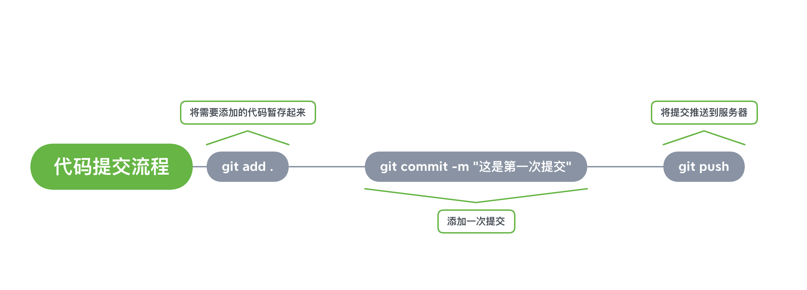

# Git 的使用
> Git 是一个高效的代码版本管理工具，团队之间代码同步开发必备工具

### 资源链接
[Git 下载安装](https://git-scm.com/)

[GitHub](https://www.runoob.com/java/java-inheritance.html)

[码云](https://gitee.com/)

### 逻辑导航
- Git 是什么？GitHub 是啥？
- 怎么安装 Git
- 怎么用 Git 将代码提交到 GitHub 或码云
- 提交代码的流程
- 怎么拉取别人的代码

### 提交代码的流程
